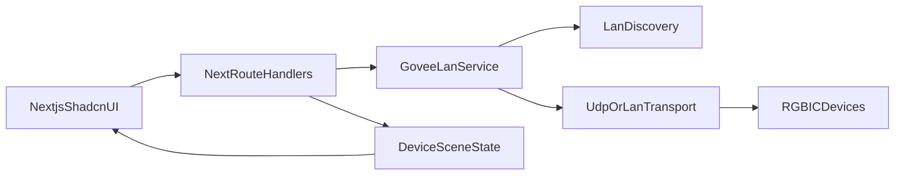

# Plano para iniciar o projeto Govee-like

## Comando oficial de scaffold (shadcn docs)
Usar o CLI atual do shadcn para já criar o projeto Next.js:

- `npx shadcn@latest init -t next`

Alternativas oficiais:
- monorepo: `npx shadcn@latest init -t next --monorepo`
- via preset: `npx shadcn@latest init --preset [CODE] --template next`

## Objetivo técnico do MVP (fase 1)
Construir uma base "app-like" responsiva, com UX semelhante à Govee, já preparada para backend de controle LAN.

- Layout mobile-first com adaptação para desktop.
- Estrutura por módulos: dispositivos, cenas, automações, configurações.
- Estado global para dispositivos e cenas.
- Camada de integração LAN desacoplada da UI.

## Arquitetura proposta

## Fases de implementação

### Fase 0 — Bootstrapping e design system
- Gerar projeto com `shadcn init -t next`.
- Adicionar componentes base (ex.: `button`, `card`, `sheet`, `tabs`, `slider`, `switch`, `dialog`, `input`, `badge`).
- Definir tokens visuais e tema base para visual próximo do app Govee.

Arquivos principais esperados:
- [app/layout.tsx](app/layout.tsx)
- [app/page.tsx](app/page.tsx)
- [components/ui](components/ui)
- [components.json](components.json)
- [tailwind.config.ts](tailwind.config.ts)

### Fase 1 — Shell da aplicação (responsiva)
- Criar navegação principal com bottom bar (mobile) e sidebar (desktop).
- Criar páginas iniciais: Dashboard, Devices, Scenes, Automations, Settings.
- Implementar cards de dispositivo com status, brilho e cor.

Arquivos alvo:
- [app/(dashboard)/page.tsx](app/(dashboard)/page.tsx)
- [app/devices/page.tsx](app/devices/page.tsx)
- [app/scenes/page.tsx](app/scenes/page.tsx)
- [components/layout/app-shell.tsx](components/layout/app-shell.tsx)
- [components/devices/device-card.tsx](components/devices/device-card.tsx)

### Fase 2 — Modelo de domínio e estado
- Definir tipos para `LightDevice`, `Scene`, `Segment`, `Effect`.
- Criar store global (ex.: Zustand) para sincronizar UI e comandos.
- Implementar dados mock para desenvolvimento sem hardware.

Arquivos alvo:
- [lib/domain/types.ts](lib/domain/types.ts)
- [lib/state/use-light-store.ts](lib/state/use-light-store.ts)
- [lib/mocks/devices.ts](lib/mocks/devices.ts)

### Fase 3 — Integração LAN (base de produção)
- Criar serviço LAN para descoberta e comando de dispositivos.
- Expor API interna no Next (Route Handlers) para a UI chamar sem acoplamento.
- Implementar comandos mínimos: on/off, brilho, cor/efeito.

Arquivos alvo:
- [lib/govee/lan-client.ts](lib/govee/lan-client.ts)
- [lib/govee/discovery.ts](lib/govee/discovery.ts)
- [app/api/devices/route.ts](app/api/devices/route.ts)
- [app/api/devices/[id]/state/route.ts](app/api/devices/[id]/state/route.ts)

### Fase 4 — Qualidade e entrega
- Estados de erro/reconexão e feedback em tempo real.
- Testes básicos de camada de serviço e validação de payloads.
- Ajustes de acessibilidade e performance (Lighthouse mobile).

Arquivos alvo:
- [lib/govee/__tests__/lan-client.test.ts](lib/govee/__tests__/lan-client.test.ts)
- [components/common/error-state.tsx](components/common/error-state.tsx)

## Critérios de aceite iniciais
- Projeto Next.js + shadcn criado com sucesso usando comando oficial.
- UI responsiva funcional com navegação e telas principais.
- Mock completo para simular uso sem dispositivo real.
- Integração LAN com ao menos descoberta e controle básico de 1+ dispositivo RGBIC.

## Riscos e mitigação
- Protocolo LAN pode variar por modelo de dispositivo: isolar adaptadores por modelo.
- Descoberta em rede local pode falhar em algumas topologias: fallback por IP manual.
- Diferenças entre app mobile e web: priorizar paridade funcional antes de paridade visual total.